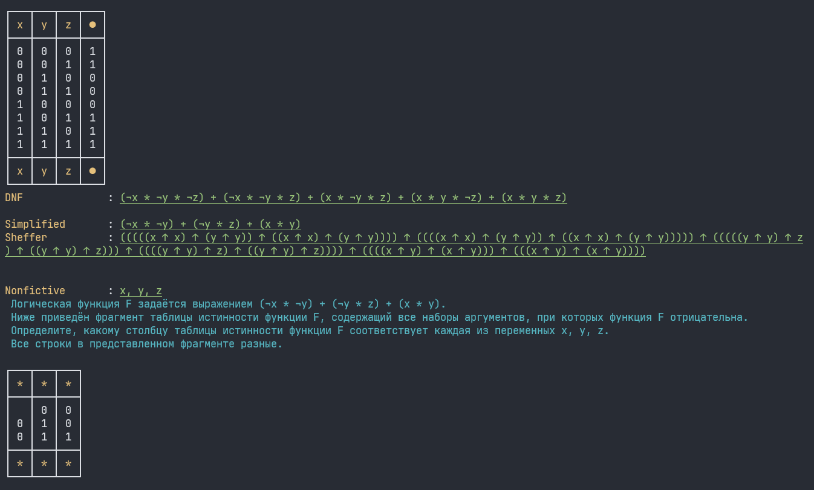

# Bool hacker



## Task

Learn how to process logical expressions in Python, and learn the SDNF reduction algorithm.

## Features

- Colorful output
- Truth table
- DNF/SDNF
- Sheffer basis
- Fictive variables detector
- EGE task generator

## How to run

```shell
git clone https://github.com/ZavaruKitsu/binary_expressions
cd binary_expressions

# run
python main.py
```

## Project structure

> tests.py

Just a bunch of example functions.

> main.py

Entry point. Runs all tests from `tests.py`

> bool_hacker.py

Contains all the functions to work with binary expressions.
